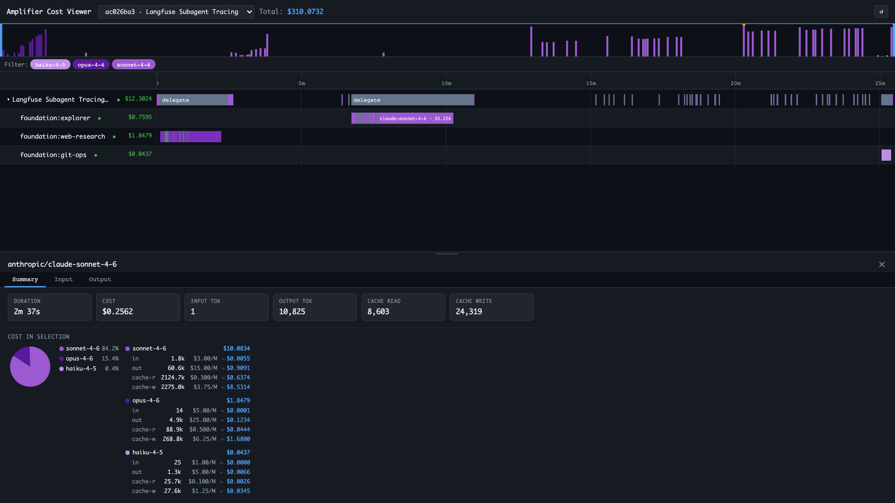

# amplifier-app-cost-viewer

Interactive token cost timeline for [Amplifier](https://github.com/microsoft/amplifier) sessions. Reads directly from `~/.amplifier/projects/` — no instrumentation or hook module required.



## What it shows

- **Timeline** — every LLM call as a span bar, color-coded by model, across the full session duration
- **Agent tree** — hierarchical breakdown of root session → delegated sub-agents → cost per branch
- **Pie chart** — cost share by model for whatever time window is in view
- **Pricing math** — per-model breakdown showing token type × rate = cost:
  ```
  sonnet-4-6          $10.03
    in      1.8k  ×  $3.00/M  =  $0.0055
    out    60.6k  ×  $15.00/M =  $0.9091
    cache-r  2.1M  ×  $0.30/M  =  $0.6374
    cache-w  2.3M  ×  $3.75/M  =  $8.5314
  ```
- **Model filter pills** — toggle individual models on/off in the timeline
- **Click any span** — opens the detail drawer with duration, cost, token counts, and raw input/output

## Install & run

```bash
cd viewer
uv run amplifier-cost-viewer               # http://127.0.0.1:8181
uv run amplifier-cost-viewer --port 9000   # custom port
uv run amplifier-cost-viewer --host 0.0.0.0 --port 8181  # network-accessible
```

Requires Python 3.11+. Dependencies: `fastapi`, `uvicorn` — no Amplifier installation needed.

## Data source

Reads the Amplifier kernel's native event logs:

```
~/.amplifier/projects/<project>/sessions/<session_id>/
    events.jsonl    — kernel event stream
    metadata.json   — session metadata
```

Token cost is computed locally using the bundled pricing table (`viewer/amplifier_app_cost_viewer/pricing.py`).

## Updating pricing

```bash
python scripts/update_pricing.py
```

Fetches the latest model prices from [LiteLLM's catalog](https://github.com/BerriAI/litellm) and rewrites `pricing.py`. Run this when new models are released or rates change.
